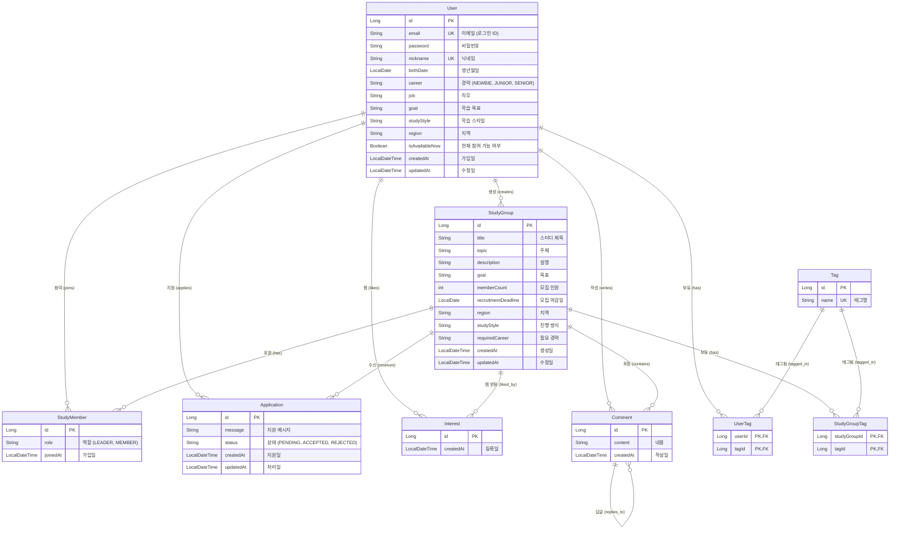

# 🗄️ StudyLink 데이터베이스 스키마 (Database Schema)

## ER 다이어그램 (ER Diagram)

## 테이블 설명 (Table Descriptions)

### 1. User (사용자)
사용자 계정 정보 및 프로필을 저장합니다.
- **id**: 기본 키 (PK)
- **email**: 고유 이메일 주소 (로그인 ID)
- **nickname**: 고유 닉네임
- **career**: 경력 수준 (NEWBIE, JUNIOR, SENIOR)
- **studyStyle**: 선호 학습 방식 (ONLINE, OFFLINE, HYBRID)

### 2. StudyGroup (스터디 그룹)
사용자가 생성한 스터디 그룹 정보를 저장합니다.
- **id**: 기본 키 (PK)
- **creator_id**: 외래 키 (User) - 스터디장(Leader)
- **recruitmentDeadline**: 모집 마감 날짜
- **requiredCareer**: 참여에 필요한 최소 경력 수준

### 3. StudyMember (스터디 멤버)
스터디 그룹에 참여 중인 사용자를 매핑하는 테이블입니다.
- **user_id**: 외래 키 (User)
- **study_group_id**: 외래 키 (StudyGroup)
- **role**: 역할 (LEADER: 스터디장, MEMBER: 일반 멤버)

### 4. Application (지원서)
사용자가 스터디 그룹에 참여하기 위해 보낸 지원서를 저장합니다.
- **applicant_id**: 외래 키 (User) - 지원자
- **study_group_id**: 외래 키 (StudyGroup)
- **status**: 상태 (PENDING: 대기, ACCEPTED: 수락, REJECTED: 거절)

### 5. Interest (관심/찜)
사용자가 관심 있는 스터디를 찜한 정보를 저장합니다.
- **user_id**: 외래 키 (User)
- **study_group_id**: 외래 키 (StudyGroup)
- **Unique Constraint**: (user_id, study_group_id) 쌍은 유일해야 합니다. (중복 찜 불가)

### 6. Comment (댓글)
스터디 그룹 페이지에 작성된 댓글 및 대댓글을 저장합니다.
- **study_group_id**: 외래 키 (StudyGroup)
- **author_id**: 외래 키 (User) - 작성자
- **parent_id**: 외래 키 (Comment) - 대댓글일 경우 부모 댓글 ID

### 7. Tag (태그)
고유한 태그 이름을 저장합니다. (예: #Java, #Spring)
- **name**: 태그명 (중복 불가)

### 8. UserTag & StudyGroupTag
태그와 사용자, 태그와 스터디 그룹을 연결하는 다대다(N:M) 매핑 테이블입니다.
